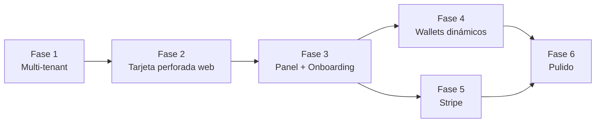

Updated todo list

# Análisis y plan hacia el MVP Pro

> **Progreso**: ✅ **B1 completado** (2026-07-01) — esquema multi-tenant (`businesses`, `business_users`, `business_id` en `customers`/`visits`/`rewards`/`locations`), trigger de premio configurable por negocio (3–20 visitas), vista `customer_stats` con `visits_required`/`reward_label` por negocio, RLS por tenant. App actualizada para leer la config dinámica (ya no hay `VISITS_PER_REWARD`/`REWARD_LABEL` fijos). Pendiente: correr `supabase/schema.sql` en el proyecto Supabase y pegar el `SUPABASE_SERVICE_ROLE_KEY` en `.env.local`.

## Dónde estás hoy

La base es sólida: registro, tarjeta web con QR, panel admin, trigger de premios y `.pkpass` firmado en servidor. Lo que pides agrega 4 frentes nuevos:

1. **Multi-tenant** (negocios con su propia config 3–20 visitas)
2. **Tarjeta perforada dinámica** (círculos que se llenan) — en web es trivial; en Wallet requiere **actualización push del pase**
3. **Google Wallet** (no existe aún)
4. **Stripe** (mensualidad + metered por tarjeta)

Punto técnico clave que debes conocer: para que el pase se actualice en el teléfono al sumar una visita:
- **Apple**: hay que implementar el **PassKit Web Service** (endpoints de registro de dispositivos + notificación vía APNs). Sin esto, el pase queda estático. El visual de perforaciones se logra generando la **imagen `strip.png` dinámicamente** (renderizar N círculos llenos/vacíos como PNG en el servidor).
- **Google**: mucho más simple — es una API REST; haces `PATCH` al *loyalty object* y el cambio aparece solo. Los círculos se muestran actualizando el campo de puntos y/o una imagen generada.

---

## PARTE A — Actividades que haces TÚ (no requieren código)

| # | Actividad | Detalle | Cuándo |
|---|---|---|---|
| A1 | **Cuenta Apple Developer** ($99/año) | Crear **Pass Type ID** (`pass.com.tudominio.loyalty`), certificado de firma → exportar `.p12` → convertir a PEM (ya documentado en README §5). Anotar Team ID | Ya / Fase 2 |
| A2 | **Apple Push (APNs)** | En la misma cuenta: crear una **APNs Auth Key (.p8)** — se usa para avisar al iPhone que el pase cambió | Fase 4 |
| A3 | **Google Wallet Issuer** | Ir a [Google Pay & Wallet Console](https://pay.google.com/business/console) → solicitar cuenta de **Issuer** (gratis, requiere aprobación ~días) → crear Service Account en Google Cloud con permiso Wallet API → descargar JSON key | Fase 2 (pedirla ya, tarda) |
| A4 | **Cuenta Stripe** | Activar cuenta, modo test primero. Definir precios: mensualidad (ej. $X MXN/mes) y precio por tarjeta extra (metered). Definir cuántas tarjetas gratis incluye el plan | Fase 5 |
| A5 | **Dominio** | Comprar dominio del SaaS, configurarlo en Vercel. Decidir: slug (`app.tudominio.com/b/mi-cafe`) o subdominio por negocio | Fase 1 |
| A6 | **Supabase Pro** (opcional al inicio) | El free tier sirve para desarrollo; para producción con clientes reales considera el plan Pro ($25/mes) | Antes de lanzar |
| A7 | **Definición de producto** | Decidir: nombre del SaaS, planes/precios exactos, cuántas tarjetas gratis, política de impago (¿se congela el negocio?), textos legales (privacidad — guardas teléfonos y cumpleaños) | Fase 1 |
| A8 | **Assets de marca** | Logo del SaaS + plantillas de ejemplo. Cada negocio subirá su logo, pero necesitas defaults bonitos | Fase 3 |

---

## PARTE B — Módulos de desarrollo (para trabajar con la IA, en orden)

### Fase 1 — Núcleo multi-tenant (fundación, todo depende de esto)
| Módulo | Qué se construye |
|---|---|
| **B1. Esquema multi-tenant** | Tabla `businesses` (nombre, slug, logo_url, colores, `visits_required` **3–20 con CHECK**, `reward_label`, límites de plan). Agregar `business_id` a `customers`, `visits`, `rewards`, `locations`. Migración del schema actual |
| **B2. Trigger configurable** | Reescribir `grant_reward_on_tenth_visit` → lee `visits_required` del negocio del cliente. Vista `customer_stats` con datos del negocio incluidos |
| **B3. Auth de negocios** | Supabase Auth (email+password): registro/login de negocios, tabla `business_users` con roles (owner/staff), políticas RLS por tenant. Reemplaza `ADMIN_PASSWORD` |
| **B4. Rutas por negocio** | `/b/[slug]` (registro de clientes del negocio), `/b/[slug]/card/[id]`, panel en `/dashboard` (autenticado). Middleware nuevo |

### Fase 2 — Tarjeta perforada dinámica (web primero)
| Módulo | Qué se construye |
|---|---|
| **B5. Componente PunchCard** | Reemplazar `ProgressBar` por grid de N círculos (3–20) que se llenan con cada visita; usa colores/logo del negocio. Animación al llenarse |
| **B6. Editor de tarjeta** | En `/dashboard/diseño`: subir logo (Supabase Storage), elegir colores, nombre del premio, visitas requeridas (slider 3–20), **preview en vivo** de la tarjeta |

### Fase 3 — Panel del negocio (MVP operable)
| Módulo | Qué se construye |
|---|---|
| **B7. Dashboard del negocio** | Migrar el panel admin actual a multi-tenant: buscar cliente, +1 visita, canjear, historial — todo filtrado por `business_id`. Modo "escáner": leer QR del cliente con la cámara y sumar visita en 1 tap |
| **B8. Onboarding** | Wizard: registrarse → configurar tarjeta → obtener link/QR de registro para imprimir en el mostrador |
| **B9. Analytics básico** | Tarjetas emitidas, visitas del mes, premios canjeados, clientes recurrentes |

### Fase 4 — Wallets dinámicos (lo más técnico)
| Módulo | Qué se construye |
|---|---|
| **B10. Strip dinámico Apple** | Generar `strip.png` del `.pkpass` en servidor: N círculos llenos/vacíos con los colores del negocio (con `sharp` o SVG→PNG). El pase ya se ve "perforado" al descargarlo |
| **B11. PassKit Web Service** | Endpoints estándar de Apple (`/v1/devices/...`, `/v1/passes/...`) + tabla `pass_registrations` + envío de push APNs (con la key .p8 de A2) tras cada visita → **el pase se actualiza solo en el iPhone** |
| **B12. Google Wallet** | Crear *Loyalty Class* por negocio y *Loyalty Object* por cliente vía API. Botón "Add to Google Wallet" (JWT firmado con el service account de A3). `PATCH` del objeto tras cada visita |
| **B13. Hook de actualización** | Un solo punto: `addVisit`/`redeemReward` → actualizar BD → push Apple + patch Google en paralelo |

### Fase 5 — Monetización Stripe
| Módulo | Qué se construye |
|---|---|
| **B14. Stripe Billing** | Checkout de suscripción al registrarse (con trial si quieres), Customer Portal para que el negocio gestione su pago |
| **B15. Metered billing** | Reportar a Stripe cada tarjeta emitida sobre la cuota gratis (usage records). Contador `cards_issued` por negocio |
| **B16. Webhooks + enforcement** | Webhook de Stripe: alta/impago/cancelación → estado del negocio (`active/past_due/canceled`). Bloquear emisión de tarjetas nuevas si excede cuota sin pago o si está moroso |

### Fase 6 — Pulido MVP Pro
| Módulo | Qué se construye |
|---|---|
| **B17. Anti-fraude básico** | Evitar doble visita: cooldown configurable (ej. 1 visita por cliente cada X horas) |
| **B18. Landing del SaaS** | Página de venta con precios y demo |
| **B19. Emails transaccionales** | Bienvenida, recibo, aviso de cuota (Resend) |
| **B20. WhatsApp** (post-MVP) | Notificación de premio ganado, link de tarjeta al registrarse |

---

## Orden recomendado y dependencias

**Sugerencia práctica**: al terminar la Fase 3 ya tienes un producto vendible manualmente (tarjeta web dinámica funciona perfecto sin Wallet) — puedes probarlo con 2-3 negocios reales mientras desarrollas Fases 4 y 5. Google Wallet (B12) es notablemente más fácil que el web service de Apple (B11); si quieres un quick win en wallets, empieza por Google.

**Tus acciones inmediatas**: A3 (solicitar cuenta Google Wallet Issuer, tarda en aprobarse), A5 (dominio) y A7 (definir precios/planes). En paralelo empezamos con B1–B4. 

Plan entregado. Cuando quieras arrancar, dime "empezamos con B1" y comenzamos con el esquema multi-tenant.

Created 10 todos